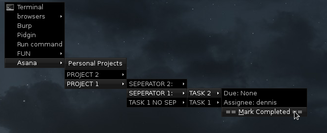

# asana_pipe_menu
Makes an openbox pipemenu for asana tasks.

This is not complete by any means but does what I want it to do (mostly)
so I  am happy with it.

# Make it work
Download the .py file and put it where you like it.  Running the program
the first time should prompt you to make your config file.  Just answer
the questions.  Then add the path to the script inside your openbox menu.xml
file, something like: 

`<menu execute="~/.config/path_stuff/asana_pipe.py" id="List Asana Projects" label="Asana"/>`

# Security Warning
Your access_tokens are as good as credentials.  These are stored in plain text
inside of a config file.  Anyone with access to your computer can steal them.  
Additionally it makes a cache file of the tasks you have inside the /tmp
directory.
